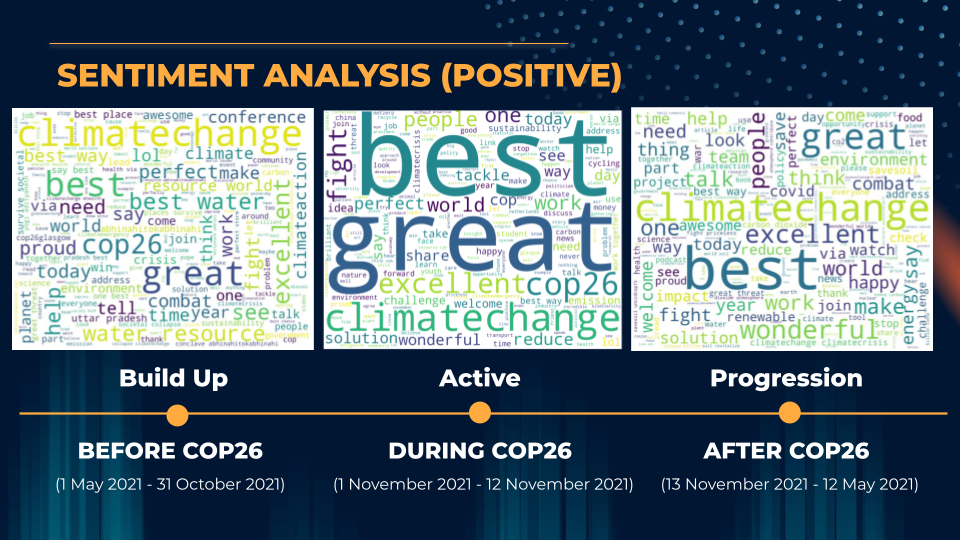
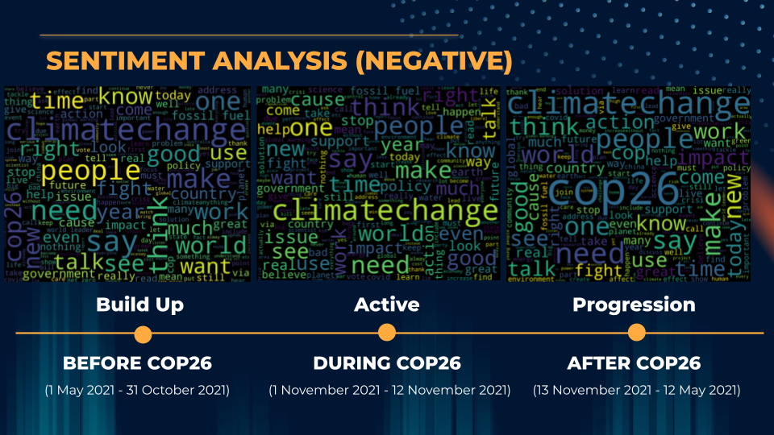
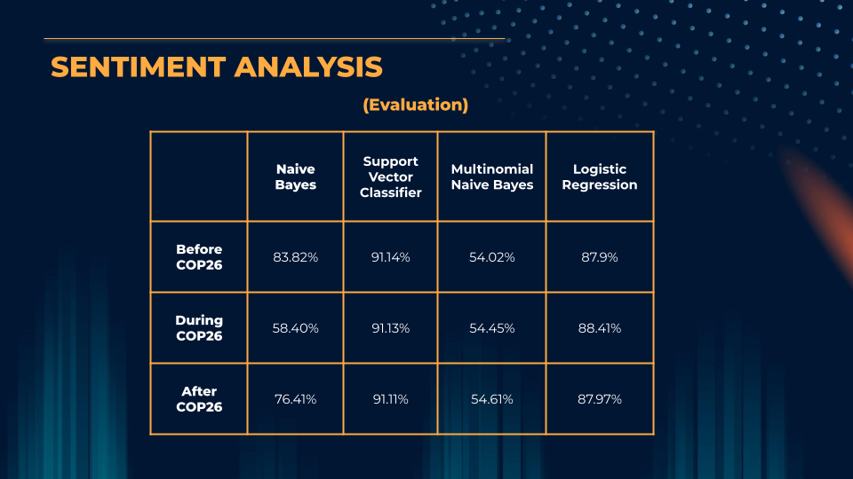

# COP26 Climate-Change-Sentiment-Analysis

This project focuses on identifying the Sentiment Analysis trend across three Scenarios pertaining to the commencement of United Nation's Climate Change Confererence of Parties (COP26) hosted at Glasgow, Scotland. The Scenarios are as follows:

1. 6 Months before COP26
2. During COP26
3. 6 months after COP26

The data is scraped from Twitter and undergoes a meticulous process of exploration, cleaning and analysis. The Twitter Scrapers for each scenarios are labelled in the Twitter Scraper folder while the Sentiment Analysis is labelled in uploaded as Jupyter Notebooks.

The Sentiment Analysis was Evaluated using different methods. The results are as follows:

